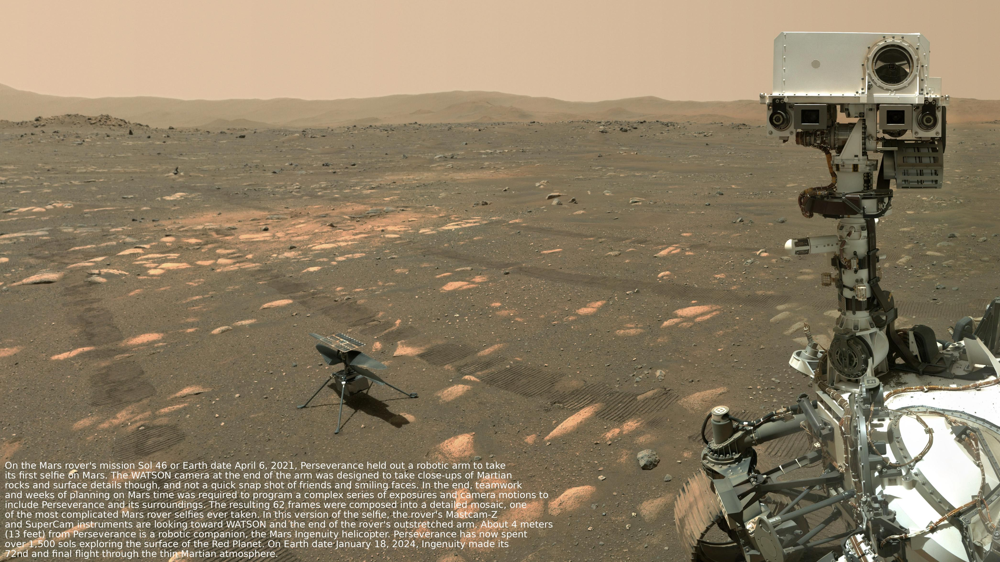

# Building an Automated NASA Picture Downloader 🚀

Ever wanted to have stunning space images as your desktop wallpaper? I certainly did! That's why I created a Python script that automatically downloads NASA's **Astronomy Picture of the Day (APOD)** and adds its scientific explanation as a text overlay.

## Example Output



[Check original APOD post here](https://apod.nasa.gov/apod/ap250607.html)


## The Idea 💡

NASA offers an amazing service called [APOD](https://apod.nasa.gov/apod/), where they publish a new astronomical photograph every day along with a detailed explanation. While you can manually visit the website, this script automates the process and creates something more: a wallpaper that not only looks beautiful but also teaches you something about space!

## Technical Implementation 🛠️

### 1. Getting Started with NASA's API

First, I needed to interact with NASA's API. This required:
- Setting up a free **NASA API key** (you can get one [here](https://api.nasa.gov/))
- Using Python's `requests` library to fetch the daily image data
- Implementing proper error handling for API responses

### 2. Image Processing

The project got more interesting when I added these features:
- Using **Pillow** (Python Imaging Library) to process the images
- Implementing text wrapping with `textwrap` to make the explanation readable
- Calculating the optimal font size based on image dimensions
- Positioning the text overlay in a way that doesn't interfere with the main image

### 3. Cross-Platform Compatibility

One challenge was making this work seamlessly between **WSL** (Windows Subsystem for Linux) and Windows:
- Creating temporary storage in the WSL filesystem
- Converting paths between WSL and Windows formats
- Ensuring proper file handling across different operating systems

## Code Structure and Best Practices 📝

I structured the code following several key principles:
- **Type hints** for better code maintainability
- Clear function documentation using docstrings
- Proper error handling with specific exception types
- Modular design with single-responsibility functions

Here's a quick look at the main workflow:
1. Load configuration and API key
2. Fetch the daily image data from NASA
3. Download and process the image
4. Add the explanation text overlay
5. Save the final image in the desired location

## Learning Outcomes 🎓

This project helped me improve my skills in:
- **API Integration**: Working with REST APIs and handling responses
- **Image Processing**: Using Pillow for image manipulation
- **Cross-Platform Development**: Managing files across different operating systems
- **Python Best Practices**: Type hinting, documentation, and error handling

## Future Improvements 🔮

I'm planning to add:
- Automatic wallpaper rotation
- Custom text styling options
- Support for different image aspect ratios
- A simple GUI for configuration

## Try It Yourself! 🚀

Want to give it a try? Check out the [project repository](https://github.com/ad0409/nasa-apod-scraper) and follow the setup instructions. Don't forget to create your `.env` file with your NASA API key!

Feel free to contribute or suggest improvements. Happy space exploring! 🌠

---

_Note: This project is open source and available under the MIT license._

# NASA APOD Scraper

This project is a Proof of Concept (POC) for downloading the NASA Astronomy Picture of the Day (APOD) and saving it to a specified directory.

## Features ✨

- Fetches daily images from NASA's APOD API
- Adds scientific explanation as text overlay
- Automatically scales text based on image size
- Supports WSL to Windows file transfer
- Error handling and logging
- Type hints for better code maintainability

## Prerequisites 📋

- Python 3.8 or higher
- WSL (Windows Subsystem for Linux) if running on Windows
- [uv](https://github.com/astral-sh/uv) package manager
- DejaVu Sans font (Install on Debian/Ubuntu with `sudo apt-get install fonts-dejavu`)

## Installation 🔧

1. Clone the repository:
   ```bash
   git clone https://github.com/ad0409/nasa-apod-scraper.git
   cd nasa-apod-scraper
   ```

2. Install dependencies:
   ```bash
   uv sync
   ```

3. Create a `.env` file in the project root with your NASA API key and desired Windows save path:
   ```env
   NASA_APOD_API_KEY=YOUR_API_KEY
   WINDOWS_SAVE_DIR=C:\Users\YOUR_USERNAME\Pictures\Screensaver\apod-nasa # Replace with your desired directory
   ```
   Get your API key from [NASA's API portal](https://api.nasa.gov/)

## Usage 💻

Run the script:
```bash
uv run main.py
```

The script will:
1. Fetch today's APOD image
2. Add the scientific explanation as overlay
3. Save the processed image to the path specified in the `WINDOWS_SAVE_DIR` environment variable in your `.env` file.

## Configuration 🔨

The script is configured using environment variables in the `.env` file:
- `NASA_APOD_API_KEY`: Your API key obtained from NASA.
- `WINDOWS_SAVE_DIR`: The absolute path on your Windows filesystem where the processed images will be saved.

## Error Handling 🛠️

The script includes comprehensive error handling for:
- Missing environment variables
- Failed API requests
- Image processing errors
- File system operations

## Contributing 🤝

1. Fork the repository
2. Create a feature branch
3. Commit your changes
4. Push to the branch
5. Open a Pull Request

## License 📄

This project is licensed under the MIT License - see the LICENSE file for details.

## Acknowledgments 🙏

- [NASA APOD API](https://api.nasa.gov/) for providing the amazing space images
- [Pillow](https://python-pillow.org/) for image processing capabilities
- [python-dotenv](https://github.com/theskumar/python-dotenv) for environment management